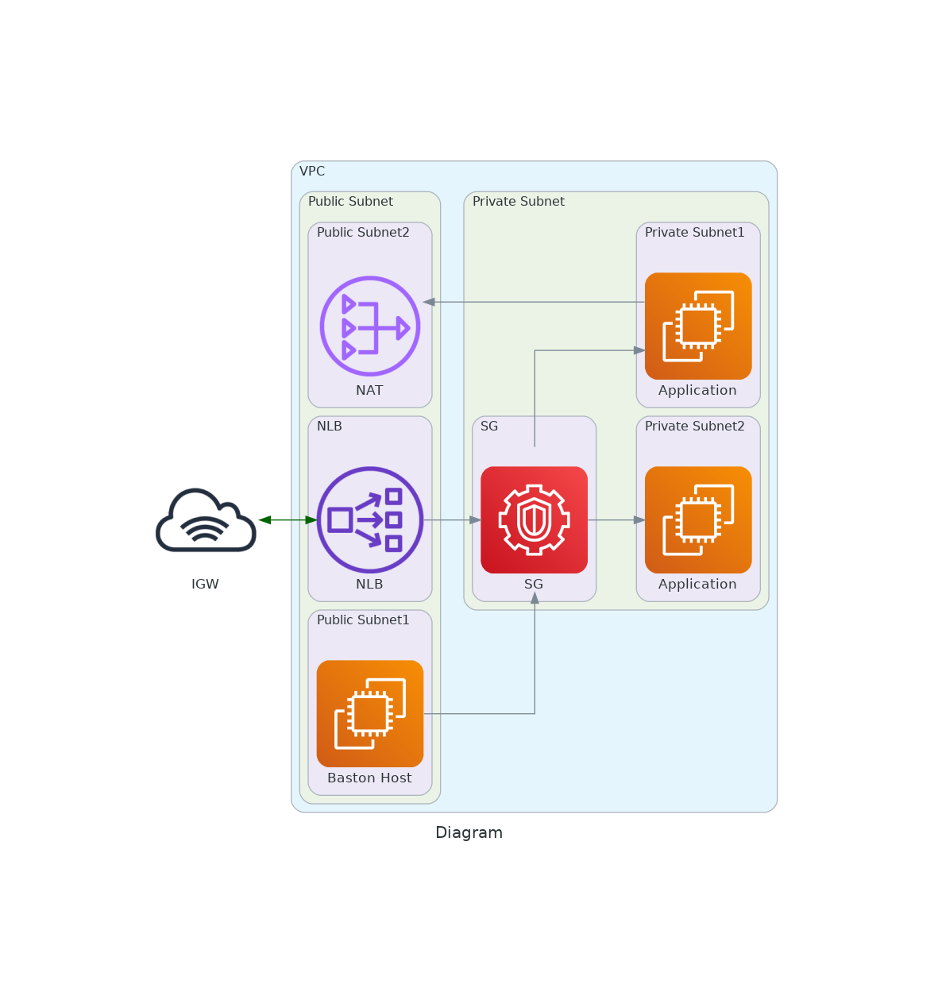

# Terraform Assignment Document

## This repo will create below resources in AWS

- VPC: For creating our own isolated network on aws cloud.
- IGW: For getting bydirection network to public subnet
- NAT: For getting internet to private subnet nodes. Only outgoing connection
- ROUTE TABLES: To associate subnet with NAT and IGW
- SECURITY GROUP: Allow traffic only from specific IP's or SG and outgoing traffic to only specific instances or internet.
- INSTANCES: It will create three instance, Two  instances in two diffrent private subnet for hosting application and one Baston host in public subnet to access the instances launced in private subnet.


## Security:

#### How the above created infra is secure and Highly available?

- Application hosted on private instances which is not directly accessible from the internet. So your application is safe
- Private instances are getting incoming connection only from Bastion host for ssh on port 22 and SG of NLB on port 80.
- Baston host is geeting incoming ssh connection only from my machine IP and outgoing ssh connection to only private subnet instances.

##### For more security we can use AWS WAL & AWS SHIELD:
- AWS WAF (Web Application Firewall) is a managed web application firewall that helps protect your web applications from common web exploits and attacks. It can be used to filter and block malicious traffic from reaching your applications, and to protect your applications from common attacks such as SQL injection, cross-site scripting (XSS), and denial-of-service attacks.

- AWS Shield is a managed distributed denial of service (DDoS) protection service that safeguards applications running on AWS. It provides protection against a wide range of DDoS attack vectors, including volumetric attacks, protocol attacks, and application layer attacks.

## HA
- The application is highly available because it is launched on two diffrent instances on two diffrent AZ.So if one of the AZ goes down, still your application would be available.

### To implement above infrastructure, Clone the repo. and execute below commands:

To initialize the repository :
```bash
terraform init
```

To draft the plan :
```bash
terraform plan
```

To create the infrastructure :
```bash
terraform apply
```

To destroy the infrastructure :
```bash
terraform destory
```
